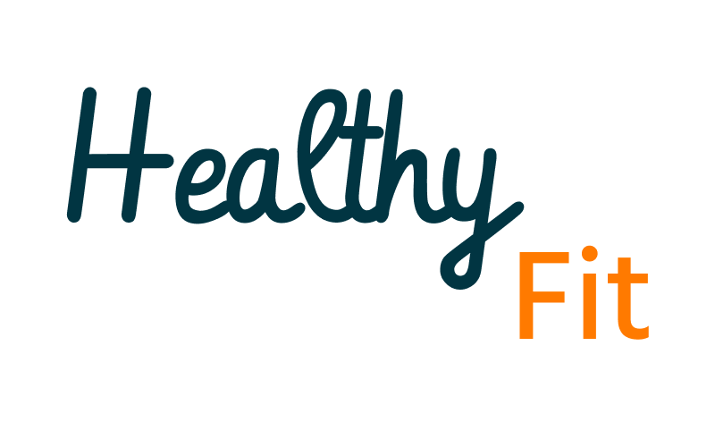
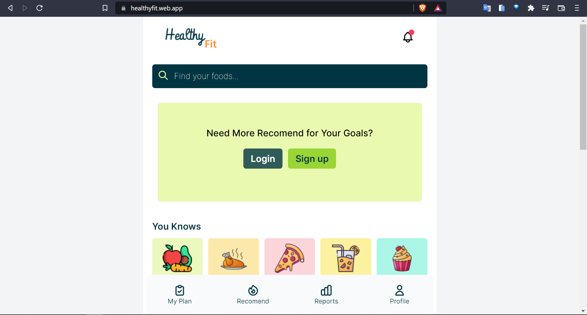
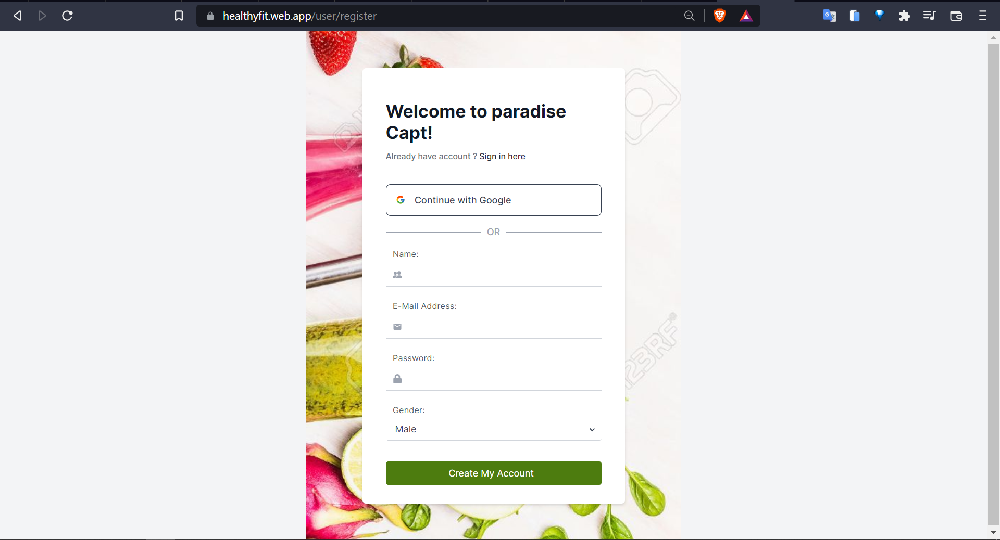

<div id="top"></div>

# Healthy Fit 🥗🍖🥛

<!-- PROJECT LOGO -->
<div align="center">
  <a href="https://github.com/FINAL-PROJECT-ALTA/FE">
    
  </a>

  <h3 align="center">Healthy Fit</h3>
  <p align="center">
   An application that aims its users to monitor eating behavior on a daily basis
    <br />
    <div id = "other-software-design"></div>
    <a href="https://healthyfit.web.app/">Demo Web</a>
    ·
    <a href="https://www.figma.com/file/PZBScHf3Gr09b4H2VonNXU/Capstone---Healthy-App?node-id=0%3A1">Figma</a>
    ·
     <a href="https://app.swaggerhub.com/apis/aaryadewangga/Final_Project/1.0#/">Open API</a>
    ·
    <a href="https://github.com/FINAL-PROJECT-ALTA/BE">Back-End</a>
    ·
    <a href="https://github.com/FINAL-PROJECT-ALTA/QE">Quality-Engineer</a>
  </p>
</div>
<br />

<!-- TABLE OF CONTENTS -->
## ✨Table of Contents
1. [About the Project](#about-the-project)
2. [Feature](#feture)
3. [Tech Stack](#tech-stack)
4. [Preview](#preview)
5. [How to Contrib](#contribute)
6. [Authors](#authors)

<!-- ABOUT THE PROJECT -->
## 📔 About The Project
-  An application that aims its users to monitor eating behavior on a daily basis


<p align="right">(<a href="#top">back to top</a>)</p>

## 🎭 Feature
-  Login and Logout
-  Create account registration

As Users
-  see the content of the food or drink
-  set a goal to get a recommendation menu calculation
-  choose the recommend menu
-  view the history of the selected menu

As Admin
-  CRUD types of food, drinks, fruit, snacks
-  CRUD types of recommend menu


<p align="right">(<a href="#top">back to top</a>)</p>

## 🎒 Tech Stack
### Framework
- Next.js - Next Js simplified simplifies HTML, routing and interactions for rapid web development
- TailwindCss - simplified to styling, with inline styling

### Build With
- [Axios](https://axios-http.com/docs/intro)
- [Redux](https://redux.js.org/introduction/getting-started)
- [React-Icons](https://react-icons.github.io/react-icons)
- [HeadlessUI](https://headlessui.dev/)
- [Sweetalert2](https://sweetalert2.github.io/)

### Deployment
- [Firebase](https://firebase.google.com/) - FireBase by Google
- [Vercel](https://vercel.com/) - Vercel

### Collaboration 
- [Trello](https://trello.com/) - Manage Project
- [Github](https://github.com/) - Versioning Project

<p align="right">(<a href="#top">back to top</a>)</p>

<!-- Preview -->
## 💻 Contribute

- Fork this repository

    ```sh
    $ git clone https://github.com/YOUR_USERNAME/FINAL-PROJECT-ALTA/FE.git
    > Cloning into `healthy-fit`...
    > remote: Counting objects: 10, done.
    > remote: Compressing objects: 100% (8/8), done.
    > remove: Total 10 (delta 1), reused 10 (delta 1)
    > Unpacking objects: 100% (10/10), done.
    ```
<p align="right">(<a href="#top">back to top</a>)</p>


<!-- Preview -->
## 👓 Preview




<p align="right">(<a href="#top">back to top</a>)</p>

<!-- CONTACT -->
## 👤 Authors
* Muhamad Fahmi Fauzan - [Github](https://github.com/fahmi-zan) · [LinkedIn](http://www.linkedin.com/in/muhamad-fahmi-fauzan)
* Adhindya Trigha Nugraha - [Github](https://github.com/Trigha) · [LinkedIn]()
* Dicky Juniansyah Putra - [Github](https://github.com/dickyrex19) · [LinkedIn](https://www.linkedin.com/in/dickyjuniansyahputra/)

<p align="right">(<a href="#top">back to top</a>)</p>
